# Plan Detail per Phase — Phase 1 (2026-08-16)

> **Tujuan dokumen**: Setiap phase punya **goal eksplisit** (WHY),
> **acceptance criteria** (HOW to verify), **tasks** (WHAT to do),
> **deliverable commit**, dan **mermaid flow diagram** untuk visualisasi
> alur kerja. **Tidak ada asumsi** — setiap task punya file:line evidence
> di spec/refactor dan setiap decision sudah K1-K7-locked.
>
> **Cara baca**: Mulai dari §1 Goal Tree → §2 Master Flow → §3 Detail per
> Phase (§3.1 sampai §3.9) → §4 Dependency Graph → §5 Done Definition.
>
> **Owner approval required** sebelum implementasi (sesuai `AGENTS.md`
> §4 workflow approval gate + `roadmap_migration.md` anti-pattern #4).

---

## 1. Goal Tree (WHY)

Spec §1 + §3 diturunkan ke goal tree. Branch di bawah ini adalah **goal
eksplisit**, bukan task. Task akan muncul di §3 per phase.

```
G0 = ROOT: Agent LLM yang pakai browser automation TANPA pegang credential,
            DENGAN license-based access control, untuk productive use cases
            (TikTok scrape, GCP access, Coretax DJP, dst).
     │
     ├─ G1 = Credential Privacy (spec §1 #1)
     │     "Username/password/SSH key/OAuth token/env var TIDAK boleh masuk
     │      ke agent context"
     │     │
     │     ├─ G1.1 = Local encrypted vault (K2, K7)
     │     │        libsecret/Secret Service. Tidak expose plaintext ke agent.
     │     │
     │     └─ G1.2 = Vault roundtrip integrity (spec §7 Quality gate 4)
     │              set → restart MCP → get = same value
     │
     ├─ G2 = Browser Execution (spec §1 #3)
     │     "Agent bisa eksekusi browser — klik, type, scroll — seperti manusia"
     │     │
     │     ├─ G2.1 = Local Playwright browser (K2, knowledge.md §3)
     │     │        headless=False di local user, CDP access untuk tools
     │     │
     │     ├─ G2.2 = Per-tab counter = billing unit (K1, K6)
     │     │        Setiap browser.new_page() = 1 tab, hit server real-time
     │     │
     │     └─ G2.3 = User-replacement pattern (spec §6.4 PAUSE/RESUME)
     │              Agent pause untuk CAPTCHA/2FA, user solve manual,
     │              agent resume otomatis
     │
     ├─ G3 = License Enforcement (spec §1, K6)
     │     "User tidak terdaftar = tidak bisa pakai fitur"
     │     │
     │     ├─ G3.1 = License check real-time (K6)
     │     │        Setiap tab increment = 2 HTTP calls (check + increment)
     │     │
     │     └─ G3.2 = Quota enforcement atomic (spec §6.3, 20_license)
     │              SQLite transaction BEGIN IMMEDIATE, no race
     │
     ├─ G4 = Multi-agent Universality (spec §1)
     │     "Agent apapun yang connect MCP (stdio) bisa pakai"
     │     │
     │     └─ G4.1 = MCP stdio transport (AGENTS §3, knowledge §4)
     │              Standard protocol, single binary command+args
     │
     ├─ G5 = Anti-piracy (K4, K5)
     │     "Kode MCP utama tidak mudah ditiru/di-copy"
     │     │
     │     ├─ G5.1 = Binary distribution (K5, 40_distribution.md)
     │     │        PyInstaller --onefile, end-user terima .bin
     │     │
     │     └─ G5.2 = License gate = business model (K5)
     │                Tanpa API key valid = tidak bisa connect
     │
     ├─ G6 = User Observability (spec §1 #4, §6.6)
     │     "User lihat apa yang agent lakukan, dan bisa intervene"
     │     │
     │     ├─ G6.1 = Web monitoring companion (spec §6.6, 45_monitoring.md)
     │     │        localhost:9876, polling 2 detik, screenshot per session
     │     │
     │     └─ G6.2 = Click-to-focus (45_monitoring.md)
     │              User klik session card → browser window front + tab fokus
     │
     ├─ G7 = Setup Simplicity (K7, 40_distribution.md)
     │     "Install sekali, run 2x = same result, owner tidak ribet"
     │     │
     │     ├─ G7.1 = Idempotent install.sh (40_distribution §Idempotency)
     │     │
     │     ├─ G7.2 = 3 install channels (40_distribution §Installation)
     │     │        pip / install.sh / PyInstaller binary
     │     │
     │     └─ G7.3 = CLI init wizard (10_mcp_server.md §init)
     │              Interactive first-time setup
     │
     └─ G8 = Validation Path (spec §9 Acceptance Criteria)
           "End-to-end: agent scrape akun TikTok via smart_connect_browser
            → data JSON kembali ke agent"
           │
           └─ G8.1 = Hermes Agent manual E2E (spec §9 #3)
                    Owner drive real Hermes Agent + scrape target
```

---

## 2. Master Flow (End-to-End)

Sequence goal-tree leaf → user action → outcome. Ini adalah
**single source of truth** untuk flow diagram di semua phase.

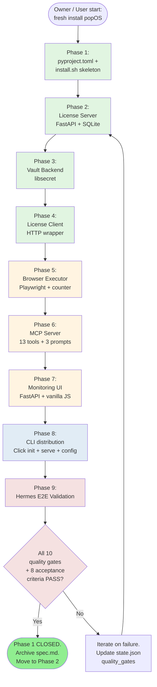

**Reading key**:
- 🟢 Phase 1-4 = foundation (zero-dep end-to-end pass)
- 🟡 Phase 5-7 = feature layer (counter, MCP, monitoring)
- 🔵 Phase 8 = CLI/DX layer
- 🔴 Phase 9 = validation

---

## 3. Detail per Phase

Tiap phase = 1 spec section + 1+ commits. Numbered sesuai master flow.

### Phase 1 — Project Bootstrap (pyproject.toml + install.sh)

**Mapped goal**: G7.1 (idempotent install), G7.2 (3 channels)
**File to create**: `pyproject.toml`, `install.sh`, `.gitignore`, `.env.example`
**Source evidence**: `refactor/30_client_arch.md` §Dependencies, `40_distribution.md` §install.sh Spec, `spec.md` §5 row 119/131/132/133

**Tasks**:
1. Write `pyproject.toml` dengan section `[project]`, `[project.optional-dependencies]` (server, dev), `[project.scripts]` (2 entry points)
2. Write `.gitignore` standard Python (`__pycache__`, `*.egg-info`, `.venv`, `.env`)
3. Write `.env.example` template kosong
4. Write skeleton `install.sh` (idempotent Python detect + venv create + skip install untuk sekarang)
5. Verify: `pip install -e ".[server,dev]"` jalan, `mcp-env-browser --help` muncul

**Done definition**:
- [ ] `pip install -e ".[server,dev]"` exit 0
- [ ] `python -m mcp_env_browser --help` jalan atau `mcp-env-browser --help` (kalau entry point register)
- [ ] `install.sh` idempotent (run 2x = same result, no duplicate venv)

**Commit**: `chore: bootstrap project (pyproject.toml + install.sh + .gitignore)`

**Flow diagram**:

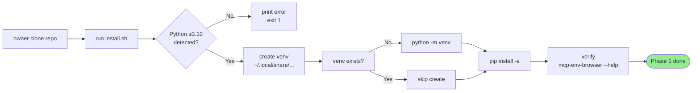

---

### Phase 2 — License Server (FastAPI + SQLite)

**Mapped goal**: G3.1 (license check real-time), G3.2 (quota atomic)
**File to create**: `src/license_server/__init__.py`, `src/license_server/server.py`, `src/license_server/db.py`, `src/license_server/api/__init__.py`, `src/license_server/api/health.py`, `src/license_server/api/license.py`, `src/license_server/api/tab.py`
**Source evidence**: `refactor/20_license_server.md` §Module Map + §Endpoints + §Database Schema

**Tasks**:
1. Buat `db.py` dengan SQLite schema (users, tab_events, alembic_version) + repository functions (atomic increment via `BEGIN IMMEDIATE`)
2. Buat `api/health.py` (`GET /health` no-auth)
3. Buat `api/license.py` (`POST /license/check`, `POST /license/register` admin token)
4. Buat `api/tab.py` (`POST /tab/increment` atomic with 429 quota-exceeded)
5. Buat `server.py` FastAPI lifespan + router aggregator
6. Verify dengan `FastAPI TestClient`: health, invalid API key → 401, quota exceeded → 429

**Done definition**:
- [ ] `mcp-env-browser-license-server serve --port 8765` start, log "[INFO] Application startup complete"
- [ ] `curl http://localhost:8765/health` → `{"status": "ok"}`
- [ ] Test `POST /license/check` dengan API key invalid → HTTP 401
- [ ] Test `POST /tab/increment` simulasi 100x concurrent → counter akurat, max 1 user dapat 429

**Commit**: `feat(license-server): FastAPI + SQLite + 3 endpoints (health, license, tab)`

**Flow diagram**:

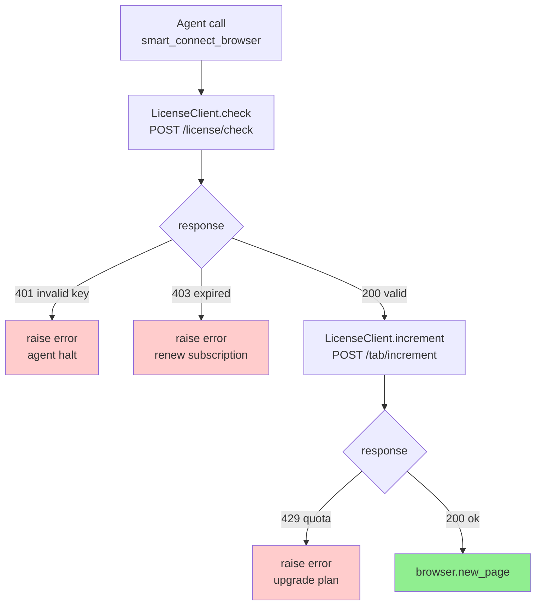

**Atomic guarantee** (`20_license_server.md` line 92-94):
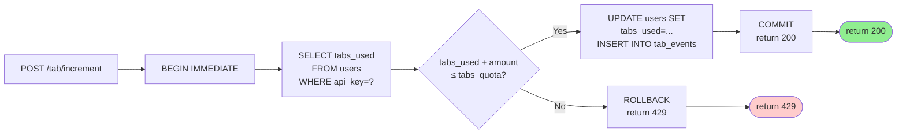

---

### Phase 3 — Vault Backend (libsecret + encrypted JSON)

**Mapped goal**: G1.1 (local encrypted vault), G1.2 (roundtrip integrity)
**File to create**: `src/mcp_env_browser/vault/__init__.py`, `secretstorage.py`, `encrypted_json.py`
**Source evidence**: `refactor/30_client_arch.md` §Vault Module, `knowledge.md` §2 libsecret

**Tasks**:
1. Define `VaultBackend` Protocol (`set/get/delete/list_keys/is_unlocked`)
2. Implement `SecretStorageBackend` pakai `python-secretstorage`, attributes schema (`{app, key, type}`)
3. Implement `EncryptedJSONBackend` pakai `cryptography` AES-GCM + scrypt KDF (fallback headless)
4. Factory function `get_vault_backend()` dengan env var `MCP_VAULT_BACKEND`
5. Verify unit test: set/get/delete, roundtrip across restart simulation

**Done definition**:
- [ ] Unit test `tests/unit/test_vault.py` PASS: SecretStorageBackend roundtrip dengan secretstorage mock
- [ ] Unit test: EncryptedJSONBackend roundtrip dengan temporary file
- [ ] Factory fallback: `MCP_VAULT_BACKEND=secretstorage` → use libsecret; `=encrypted_json` → use file
- [ ] Manual: `python -c "from mcp_env_browser.vault import get_vault_backend; b = get_vault_backend(); b.set('test_key', b'value', {'type':'api_key'}); print(b.get('test_key'))"` di popOS user

**Commit**:
- `feat(vault): VaultBackend Protocol + factory`
- `feat(vault): SecretStorageBackend (libsecret adapter)`
- `feat(vault): EncryptedJSONBackend (headless fallback + AES-GCM)`
- `test(vault): unit tests roundtrip + fallback`

**Flow diagram**:

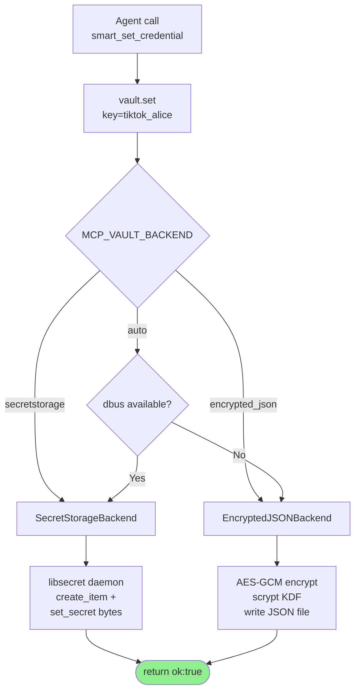

**Restart-integrity flow** (G1.2):
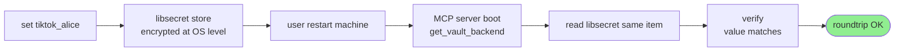

---

### Phase 4 — License Client (HTTP wrapper)

**Mapped goal**: G3.1 wiring (client side of Phase 2 server)
**File to create**: `src/mcp_env_browser/license/__init__.py`, `client.py`
**Source evidence**: `refactor/30_client_arch.md` §License Client, `knowledge.md` §5 FastAPI

**Tasks**:
1. Implement `LicenseClient` class dengan base_url + api_key + timeout=2.0
2. `check()` → POST `/license/check`, handle 401/403/200
3. `increment(amount=1)` → POST `/tab/increment`, handle 429/network
4. Config loader dari `~/.config/mcp-env-browser/config.json` + env var override
5. Unit test dengan mocked httpx Client

**Done definition**:
- [ ] `tests/unit/test_license_client.py` PASS: 5 scenarios (200/401/403/429/network)
- [ ] `from mcp_env_browser.license import LicenseClient; c = LicenseClient(api_key='test'); print(c.check())` jalan terhadap local server

**Commit**: `feat(client): license HTTP wrapper + config loader + unit tests`

**Flow diagram**: (reuses Phase 2 atomic flow, client side)

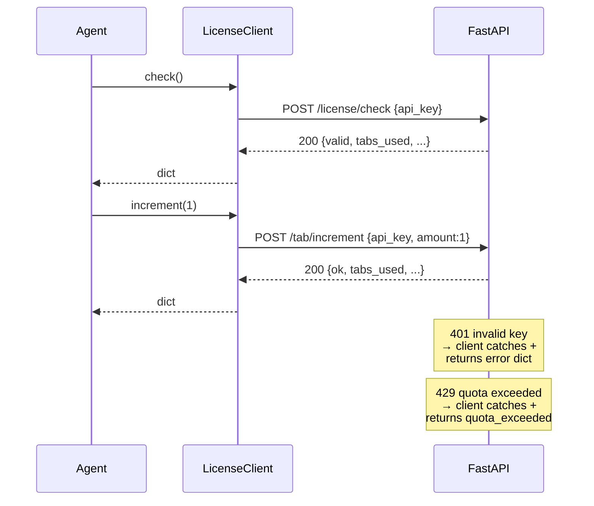

---

### Phase 5 — Browser Executor (Playwright + per-tab counter)

**Mapped goal**: G2.1 (local Playwright), G2.2 (per-tab counter)
**File to create**: `src/mcp_env_browser/browser/__init__.py`, `executor.py`, `cdp.py`
**Source evidence**: `refactor/30_client_arch.md` §Browser Module, `knowledge.md` §3 Playwright

**Tasks**:
1. `BrowserExecutor` class dengan lazy `playwright.chromium.launch(headless=False)` (local user)
2. `connect(target, credential_key, label?)` → return `{session_id, label, position, page_handle}`
3. Per-tab hook: BEFORE `browser.new_page()` call → `LicenseClient.increment(1)`. Raise kalau `quota_exceeded`
4. `list_sessions(include_screenshot?)` → return list with b64 thumbnail
5. `focus_session(session_id)` → bring window to front via Playwright page.bringToFront()
6. `close(session_id?)` → cleanup contexts
7. `CDPHelpers` class untuk Console/Network/DOM via `context.new_cdp_session(page)`
8. Unit test dengan mock `sync_playwright` (browser launch costly, jangan real di CI)

**Done definition**:
- [ ] `tests/unit/test_browser.py` PASS dengan mocked playwright: connect → increment → page.created, quota_exceeded → raise
- [ ] Manual: `python -c "from mcp_env_browser.browser import BrowserExecutor; e = BrowserExecutor(...); print(e.connect('https://example.com', 'test_cred', 'Smoke'))"` → tab terbuka di Chromium

**Commit**:
- `feat(browser): BrowserExecutor wrapper + lazy launch`
- `feat(browser): per-tab counter hook (LicenseClient before new_page)`
- `feat(browser): cdp.py Console/Network/DOM helpers`
- `test(browser): unit tests mocked playwright`

**Flow diagram**:

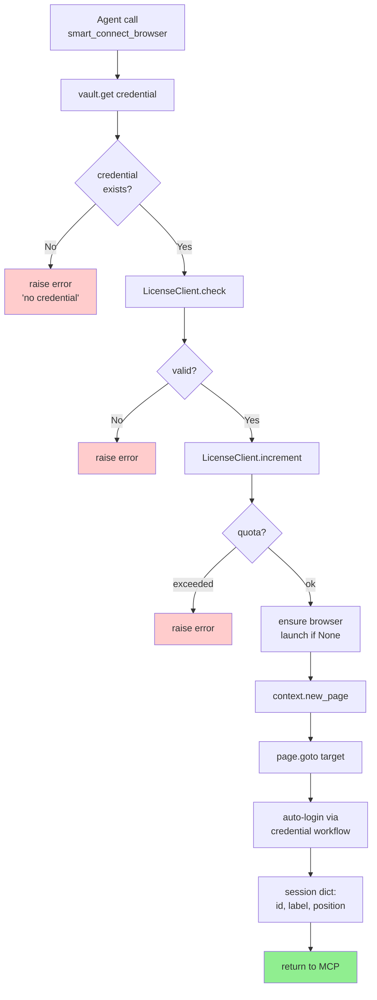

**Position tracking** (`10_mcp_server.md` line 244-247 — multi-tab clarity):
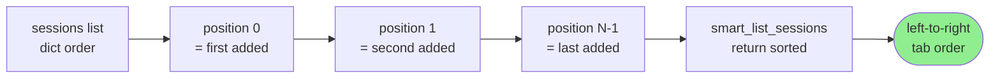

---

### Phase 6 — MCP Server (13 tools + 3 prompts)

**Mapped goal**: G2.3 (user-replacement pattern), G4.1 (multi-agent universality), most of G1
**File to create**: `src/mcp_env_browser/__init__.py`, `mcp_server.py`
**Source evidence**: `refactor/10_mcp_server.md` §MCP Tools — Detail Spec, §Pattern Implementation

**Tasks**:
1. Setup FastMCP/StdIO server dengan `app = Server("mcp-env-browser")`
2. Implement 13 tools (urutan Implementation Order phase 6):
   - `smart_list_credentials`
   - `smart_get_credential_meta`
   - `smart_set_credential`
   - `smart_delete_credential`
   - `smart_connect_browser`
   - `smart_list_sessions`
   - `smart_close_browser`
   - `smart_browser_action` (dispatch ke 11 sub-action: navigate, click, type, scroll, drag, hover, screenshot, wait_for, wait_for_navigation, evaluate, select_option, press_key)
   - `smart_browser_console_log`
   - `smart_browser_network_log`
   - `smart_browser_inspect`
   - `smart_session_pause`
   - `smart_session_resume`
3. Implement 3 prompts:
   - `oauth_confirmation_flow`
   - `browser_debug_workflow`
   - `human_intervention_workflow`
4. **WAJIB**: security check — never return password/value/token in TextContent

**Done definition**:
- [ ] `tests/unit/test_mcp_server.py` PASS: call_tool dispatch semua 13 tools dengan mock args, return types valid
- [ ] `tests/unit/test_prompts.py` PASS: 3 prompts registered, get_prompt return PromptMessage[]
- [ ] Manual: `echo '{"jsonrpc":"2.0","id":1,"method":"tools/list"}' | mcp-env-browser serve` → list 13 tools

**Commit**:
- `feat(mcp): init Server + first 4 credential tools`
- `feat(mcp): browser action tools (smart_browser_action + 11 sub-actions)`
- `feat(mcp): CDP helpers (console/network/inspect)`
- `feat(mcp): session pause/resume (user-replacement pattern)`
- `feat(mcp): 3 prompts (oauth/browser_debug/human_intervention)`
- `test(mcp): unit test dispatch all 13 tools + 3 prompts`

**Flow diagram — pause/resume** (G2.3 user-replacement):

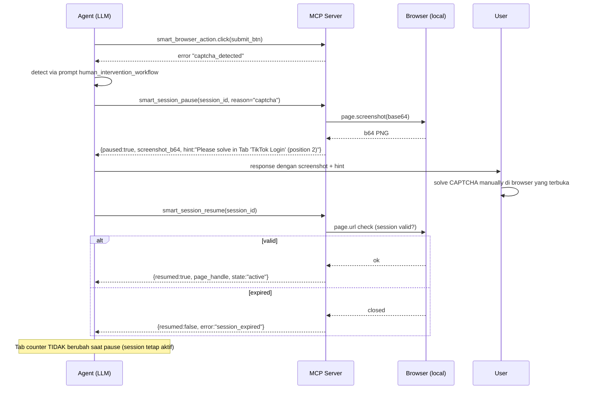

---

### Phase 7 — Web Monitoring Companion (FastAPI + vanilla JS)

**Mapped goal**: G6.1 (real-time observability), G6.2 (click-to-focus)
**File to create**: `src/mcp_env_browser/monitor.py`, `monitor.html`
**Source evidence**: `refactor/45_monitoring.md`, `spec.md` §6.6

**Tasks**:
1. `monitor.py` FastAPI app dengan 3 endpoints (`GET /`, `GET /api/sessions`, `POST /api/sessions/{id}/focus`, `GET /health`)
2. `monitor.html` vanilla JS + CSS, polling fetch `/api/sessions` setiap 2 detik
3. Session card per position dengan screenshot inline base64 + status badge + click-to-focus
4. Status color: ACTIVE (hijau), PAUSED (kuning), CAPTCHA (merah), ERROR (abu-abu)
5. Start/stop integration dengan CLI `serve` command (Phase 8 wires ini)

**Done definition**:
- [ ] `tests/unit/test_monitor.py` PASS: FastAPI TestClient untuk 3 endpoints
- [ ] Manual: `mcp-env-browser-license-server` jalan parallel + `python -m mcp_env_browser.monitor` + chromium manually open `localhost:9876` → show "No sessions yet" placeholder OK

**Commit**:
- `feat(monitor): FastAPI app + 3 endpoints`
- `feat(monitor): static HTML + vanilla JS polling`
- `test(monitor): FastAPI TestClient + screenshot embed`

**Flow diagram**:

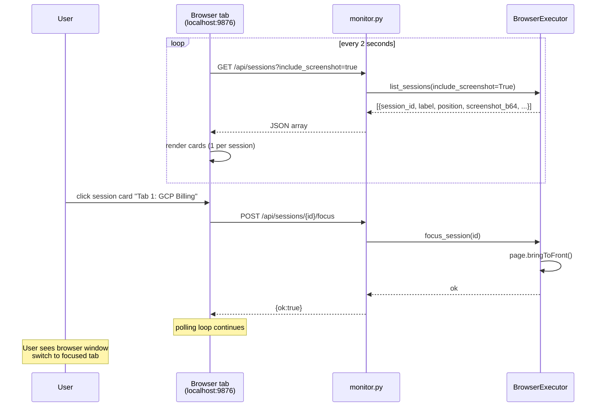

---

### Phase 8 — CLI Distribution (Click + init/serve/config)

**Mapped goal**: G7.3 (CLI init wizard), G5.1 wiring (binary distribution)
**File to create**: `src/mcp_env_browser/cli.py`
**Source evidence**: `refactor/10_mcp_server.md` §CLI Commands, `40_distribution.md` §install.sh + PyInstaller

**Tasks**:
1. Click CLI dengan 5 subcommands:
   - `init` — interactive wizard: prompt server URL + API key + save `~/.config/mcp-env-browser/config.json` + test connection
   - `serve` — start MCP stdio + monitor.http + browser executor in single process
   - `version` — print `__version__`
   - `config` — show/set-server-url/set-api-key/path
   - `doctor` — health check (vault, server, playwright version)
2. Wire monitor.http to run in same process as MCP stdio (avoid 2 processes)
3. Logging: `structlog` ke stderr + file `~/.local/share/.../logs/{date}.log`
4. Verify: `pyinstaller --onefile --name mcp-env-browser src/mcp_env_browser/cli.py` → binary jalan

**Done definition**:
- [ ] `tests/unit/test_cli.py` PASS: Click runner exercise each subcommand
- [ ] `mcp-env-browser init` interactive prompt jalan di popOS user, save config, test connection
- [ ] `mcp-env-browser serve` start jalan: stderr log "[INFO] MCP stdio + monitor ready"
- [ ] `mcp-env-browser doctor` exit 0 semua check
- [ ] `pyinstaller --onefile` produce binary < 100 MB, binary jalan

**Commit**:
- `feat(cli): Click init/serve/version/config/doctor subcommands`
- `feat(cli): structlog stderr + file handler`
- `feat(dist): PyInstaller spec file + build script`
- `test(cli): Click runner for all subcommands`

**Flow diagram**:

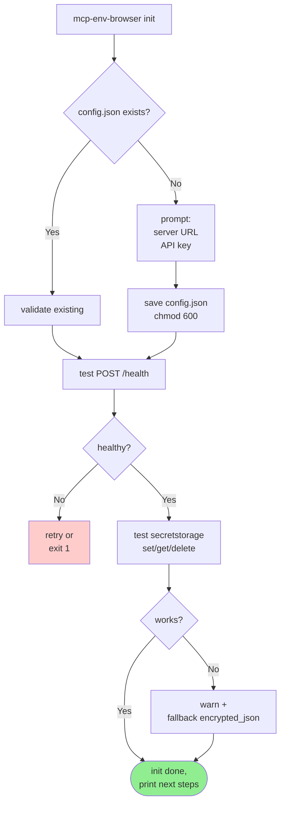

**`serve` orchestration**:

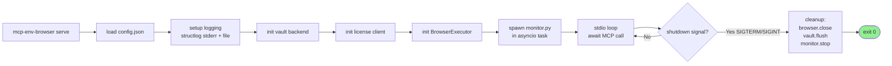

---

### Phase 9 — Hermes E2E Validation (Owner-Driven)

**Mapped goal**: G8 (full validation path — agent scrape akun TikTok → JSON)
**File to create**: `tests/manual/test_hermes_e2e.py`, validate output
**Source evidence**: `spec.md` §6 End-to-End (line 78), §9 Acceptance Criteria

**Tasks**:
1. Owner start environment: `mcp-env-browser-license-server serve &` di background
2. Owner run `mcp-env-browser init` + register API key (1 command)
3. Owner edit `.mcp.json` di Hermes config untuk point ke `mcp-env-browser serve`
4. Owner restart Hermes desktop, verify 13 tools listed
5. Owner drive Hermes Agent: "scrape akun TikTok username X" → verify 1 tab terbuka + screenshot di `localhost:9876`
6. Owner verify pause/resume: trigger captcha prompt, screenshot muncul, solve manual, verify session resume
7. Verify quality gates 1-by-1, update `state.json.quality_gates` ke `passed` (atau `skipped` kalau belum applicable)

**Done definition**:
- [ ] All 10 quality gates §7 PASS (atau honest `skipped` dengan reason)
- [ ] All 8 acceptance criteria §9 terpenuhi
- [ ] spec.md §1 background problem solved (agent tidak pegang credential, browser execution works, etc.)
- [ ] `state.json` updated: `current_stage` → `archive`, `quality_gates` → all passed/skipped
- [ ] `tahapan_implementasi.md` di-archive per spec v3 protocol (atau fallback manual jika smart_agent API down)

**Commit**:
- `docs(spec): update state.json Phase 1 → archive`
- `docs(spec): archive tahapan_implementasi.md`
- (jika applicable) `chore: prepare Phase 2 stub for roadmap_migration.md`

**Flow diagram**:

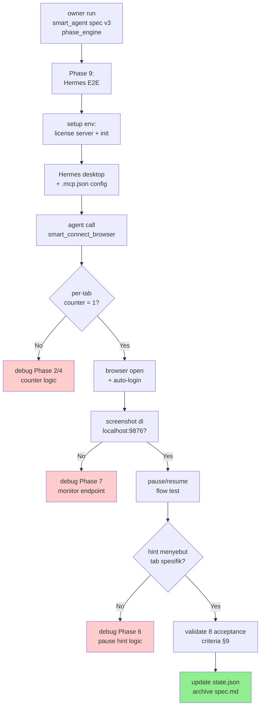

---

## 4. Dependency Graph (Phase Order)

Urutan eksekusi **WAJIB** karena ada hard dependency:

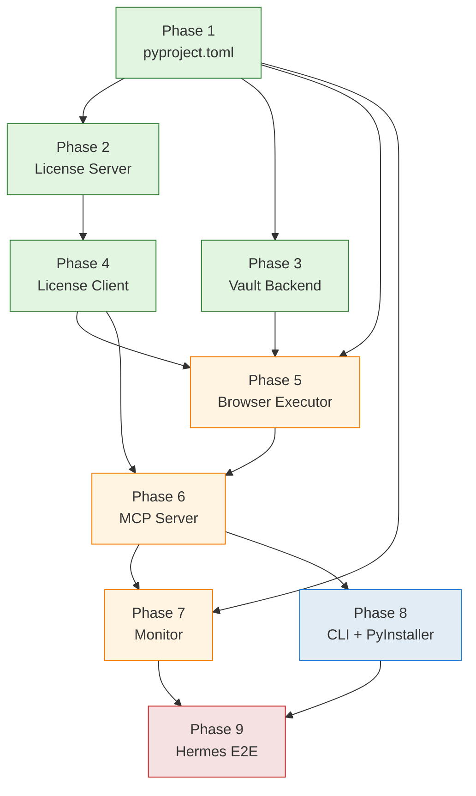

**Sequential**: P1 → P2 → P3 → P4 → P5 → P6 → P7 → P8 → P9

**Parallelizable subsets** (kalau multi-developer):
- After P1: **P2 | P3 | P7** bisa paralel (zero shared deps)
- After P2+P3: **P4 | P5** bisa paralel (P4 butuh P2 done, P5 butuh P3 done)
- P6 butuh P4+P5+P7 → sequential
- P8 butuh P6+P7 → sequential
- P9 butuh P8 → sequential

**Single-developer sequence** (recommended, KISS):
1. P1 (bootstrap)
2. P2 (license server — boleh di-test standalone via FastAPI TestClient)
3. P3 (vault — boleh di-test standalone)
4. P4 (license client — wire ke P2)
5. P5 (browser executor — wire ke P3+P4)
6. P6 (MCP server — wire ke P4+P5)
7. P7 (monitor — wire ke P5, parallel boleh dengan P6 karena endpoint shape sudah final)
8. P8 (CLI glue)
9. P9 (Hermes E2E — owner-driven)

---

## 5. Done Definition (Phase 1 Closure)

Phase 1 dianggap DONE kalau:

| # | Criterion | Verification | Source |
|---|---|---|---|
| 1 | `mcp-env-browser init` sukses di popOS user (Anda) | Owner run manual, exit 0 | spec §9 #1 |
| 2 | `mcp-env-browser serve` bisa di-connect dari Hermes Agent via `.mcp.json` | Owner restart Hermes, 13 tools listed | spec §9 #2 |
| 3 | End-to-end: agent scrape akun TikTok via `smart_connect_browser` → data JSON kembali ke agent | Owner drive Hermes with real TikTok, capture screenshot | spec §9 #3 |
| 4 | Per-tab counter akurat (cek di server DB) | `SELECT tabs_used FROM users WHERE api_key=?` | spec §9 #4 |
| 5 | License gate: API key invalid → error message jelas, tidak crash | `smart_connect_browser` dengan key invalid → "invalid api key" + tidak ada tab terbuka | spec §9 #5 |
| 6 | Install script idempotent (run 2x = same result) | `install.sh && install.sh` → no error | spec §9 #6 |
| 7 | Tests pass (≥80% coverage di core modules) | `pytest --cov` | spec §9 #7 + §7 #9 |
| 8 | Spec archive: state.json `archive`, quality_gates all passed/skipped | smart_agent spec v3 protocol | spec §9 #8 |

Quality gates per spec §7 (10 gates): functional_mcp_tools, per_tab_counter_accurate, license_gate_enforced, vault_roundtrip, web_monitoring, session_identity, click_to_act, build_success, tests_pass, docs_complete.

---

## 6. Honest Risk Register (untuk phase manapun)

| Risiko | Phase Impacted | Mitigasi |
|---|---|---|
| `secretstorage` butuh D-Bus session bus | P3 | EncryptedJSONBackend fallback (Phase 3 task #3) |
| Playwright headless blocking oleh TikTok/Google | P5, P9 | `headless=False` di local user (knowledge §3) |
| PyInstaller binary size > 100MB | P8 | Acceptable per 40_distribution §Distribution Size (~50MB binary + 150MB Chromium separate) |
| Hermes desktop tidak punya MCP stdio transport ready | P9 | Graceful fallback: manual test via `echo JSON | mcp-env-browser serve` |
| MCP stdio buffering break (print ke stdout) | P6 | structlog → stderr, NEVER print to stdout in tool handler (knowledge §4) |
| License server mati = agent total stop | P2/P4/P9 | Acceptable for Phase 1 (K6 explicit real-time). Phase 2 add offline mode (spec §8) |
| Counter race condition di multi-process Playwright | P2 | SQLite `BEGIN IMMEDIATE` atomic per 20_license_server.md line 92-94 |

---

## 7. Alasan kenapa BUKAN batch besar

Sesuai `AGENTS.md` §9 (Checklist Sebelum Commit) + `refactor/00_overview.md`
§"Implementation Order (Quick Win Sequence)" + `roadmap_migration.md`
anti-pattern: **1 logical commit per phase = 1 spec section delivered**.

Plan ini memecah jadi 9 phase × rata-rata 2-4 logical commits = ~25-30
commits total Phase 1. Owner workflow: "pecah logical commit per session,
bukan 1 bulk". Setiap commit verifiable standalone (test pass atau manual
smoke OK).

---

## 8. Yang BELUM ada di plan ini (Defer ke Phase 2/3)

Cross-check dengan `roadmap_migration.md`:

| Feature | Phase | Reason |
|---|---|---|
| OAuth auto-refresh flow | 2 | Validasi use case dulu (roadmap §Defer) |
| Master key KDF server-side | 2 | Strategi D trigger |
| Multi-tenant isolation | 3 | 100+ user base trigger |
| Dashboard Vite+Svelte+Routify+Tailwind | 3 | Multi-page + complex state needed |
| Per-target rate limit | 3 | Validate demand dulu |
| Stripe/billing integration | 3 | Subscription tier trigger |
| Cross-platform vault (Windows/macOS) | 2/3 | Linux-only Phase 1 explicit (D3, K7) |
| Self-update mechanism | 2 | Anti-pattern §40_distribution (auto-update tanpa konfirmasi = danger) |
| SSE streaming monitor | 2 | Polling 2s cukup Phase 1 (spec §6.6.1) |

---

## 9. Versi

- v1 (2026-08-16) — initial phase plan dengan goal tree, master flow,
  per-phase details + mermaid, dependency graph, done definition, honest
  risk register. Based on spec.md + 7 refactor/ + knowledge.md +
  roadmap_migration.md + state.json (semua verified via grep).
